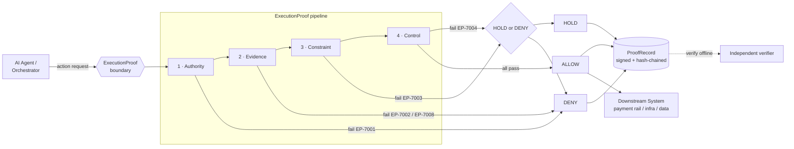
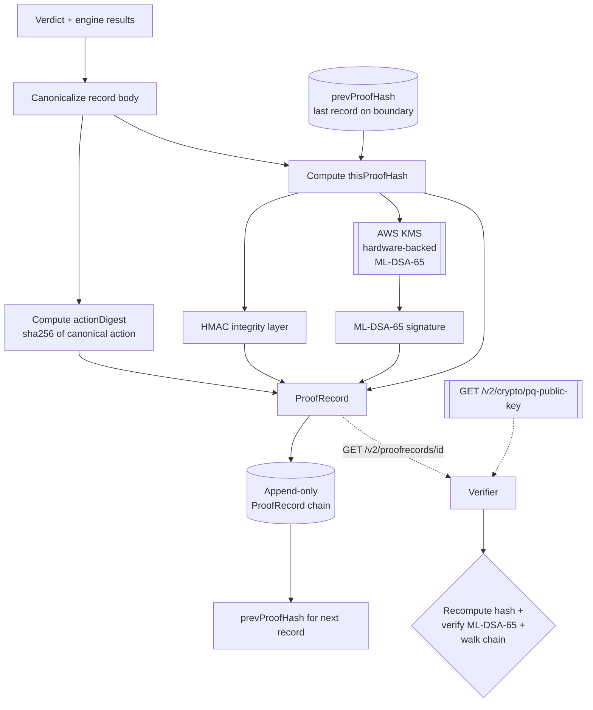
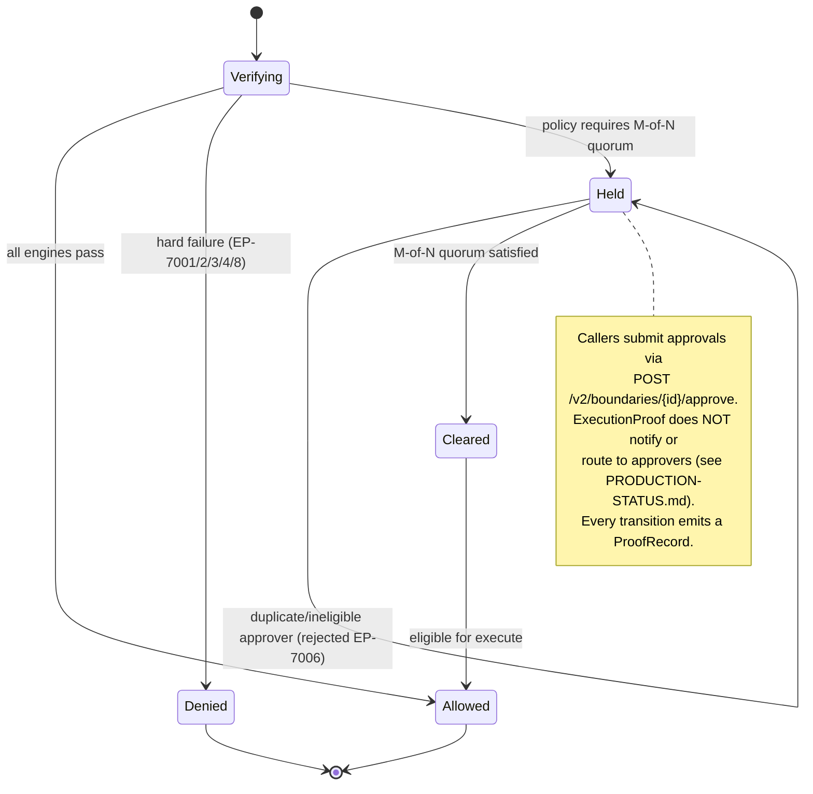

# Architecture Diagrams

> **Production Software — ExecutionProof Pre-Execution Governance Layer**

Rendered Mermaid diagrams for the ExecutionProof core. See [ARCHITECTURE.md](../ARCHITECTURE.md) for the full
prose description.

---

## 1. Decision pipeline (four engines, short-circuit)

The action flows through the four engines in order. The first engine to fail halts the pipeline and
determines the verdict. Every outcome emits a ProofRecord.

## 2. ProofRecord generation and signing

Every decision is canonicalized, hash-chained to the previous record on the boundary, then dual-signed
(HMAC + ML-DSA-65 via AWS KMS). Independent verifiers use the published PQ public key.

## 3. HOLD escalation flow (M-of-N approval state machine)

A HOLD parks the action in an M-of-N approval state machine. Approvals are **submitted to** the API;
ExecutionProof enforces the quorum and distinct/eligible approvers but does not notify or route.

---

*Built in faith. Tested in public. Claims kept narrower than the evidence.*

**Remnant Fieldworks Inc. — Derek Hone, CEO**
